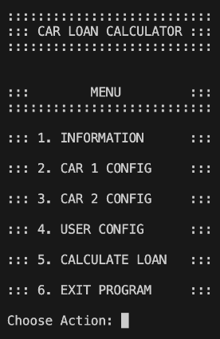
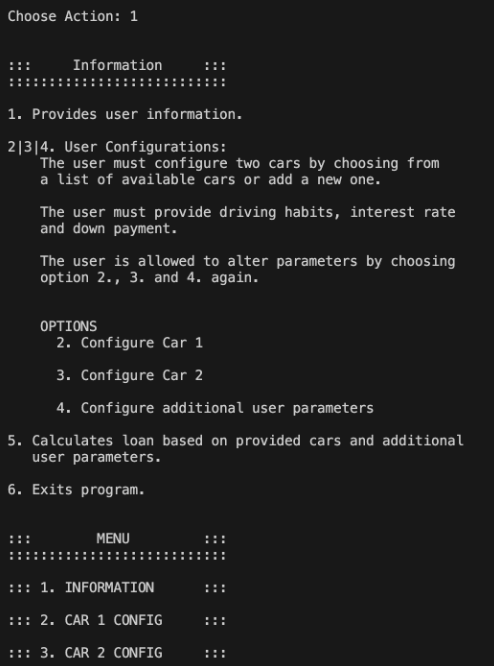
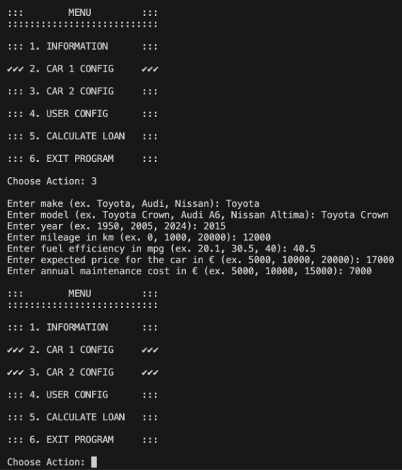
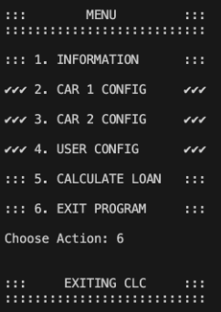

# Car Loan Calculator

## Project Summary

### Customer Request

In the US, you can purchase a car with a loan. The car loan will carry an interest rate, taxes, and fees. Gas prices also influence how much you will pay just to drive each month. I would like you to build me a calculator which runs in the terminal and asks the user for information relevant to their upcoming car purchase. The user should be able to input two vehicles and as much information you think is relevant to the car buying experience.

### Menu Screen

### User Guide

1. Provides user information.

2. Car 1 configuration.

3. Car 2 configuration.

4. User Configurations:
    The user must configure two cars by choosing from 
    a list of available cars or add a new one.
    
    The user must provide driving habits, interest rate
    and down payment. 
    
    The user is allowed to alter parameters by choosing
    option 2., 3. and 4. again. 

5. Calculates loan and gives recommendation based on provided cars and additional
   user parameters.

6. Exits program.

